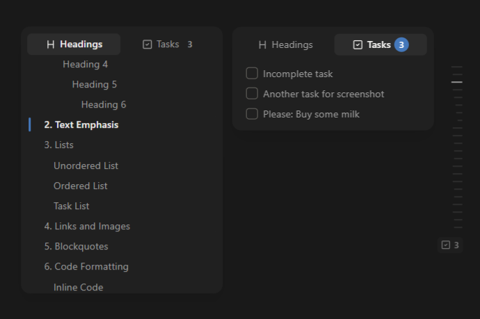

# Subtle TOC

A floating, Capacities-style table of contents for [Obsidian](https://obsidian.md).

A discreet dashed **minimap** lives on the edge of your note. Hover (or click) it
and a **popover outline** slides out — the heading for the section you're reading
is highlighted, and clicking any heading jumps to it.

It can also surface the note's **open tasks** in a second tab — with a live count
and optional one-click completion — while the minimap stays focused on structure.

## Features

- **Floating popover** overlaid on the note (no sidebar pane needed).
- **Edge minimap** of dashes, one per heading, sized by heading level.
- **Active-heading tracking** in both Editing (Live Preview / Source) and Reading mode.
- **Click to navigate** with optional smooth scroll — works in both modes.
- **Tasks tab** — the note's open tasks (unchecked checkboxes), in document order,
  as a second tab in the popover, with a live open-task count on the tab.
- **Edge task badge** — a checkbox + count on the edge whenever the note has open
  tasks (below the dashes, or on its own when the note has no headings).
- **Complete from the TOC** *(optional)* — turn on task checkboxes to tick a task
  straight from the popover; it's marked done in the note (undoable in Editing
  mode), strikes through, and drops out the next time you open the popover.
- **Show** what you want: headings, tasks, or both.
- Configurable side (left/right), open trigger (hover/click) and heading-level
  range. The heading-level range doesn't apply to tasks.

## Screenshots



## Install (Community plugins)

1. Open *Settings → Community plugins* in Obsidian.
2. Make sure **Restricted mode** is turned off (click **Turn on community plugins** if needed).
3. Click **Browse**, search for **Subtle TOC**, and open its page.
4. Click **Install**, then **Enable**.

## Install (BRAT — beta / before it's in the directory)

If the plugin isn't in the official Community plugins directory yet, you can
install it with [BRAT](https://github.com/TfTHacker/obsidian42-brat):

1. Install **BRAT** from *Settings → Community plugins → Browse* and enable it.
2. Open the command palette and run **BRAT: Add a beta plugin for testing**.
3. Paste the repository URL:
   ```
   https://github.com/xupisco/obisidian-suble-toc
   ```
4. Confirm — BRAT downloads the latest release and keeps it up to date.
5. Enable **Subtle TOC** in *Settings → Community plugins*.

## Install (manual / for development)

1. Build the plugin:
   ```bash
   npm install
   npm run build      # produces main.js
   ```
2. Copy `main.js`, `manifest.json` and `styles.css` into your vault at:
   ```
   <vault>/.obsidian/plugins/subtle-toc/
   ```
3. Reload Obsidian and enable **Subtle TOC** in *Settings → Community plugins*.

## Develop

```bash
npm install
npm run dev          # esbuild watch -> rebuilds main.js on change
```

Point the output at a test vault by symlinking the plugin folder, or copy the
three files after each build. Use the "Toggle TOC popover" command (assign a
hotkey) to open/close the outline from the keyboard.

## How it works

- Headings and tasks both come from Obsidian's `metadataCache`, so the outline
  stays in sync as you type. Tasks are the open list items (`- [ ]`) of the active
  note only.
- Active-heading detection uses CodeMirror 6 line geometry in Editing mode and
  the preview scroll position in Reading mode. Clicking a task navigates to it the
  same way headings do.
- Completing a task edits the note through the editor in Editing mode (so it's
  undoable) and writes the file directly in Reading mode.
- One overlay instance is bound to the active Markdown view at a time and rebuilt
  when you switch notes, panes or modes.

## License

MIT
